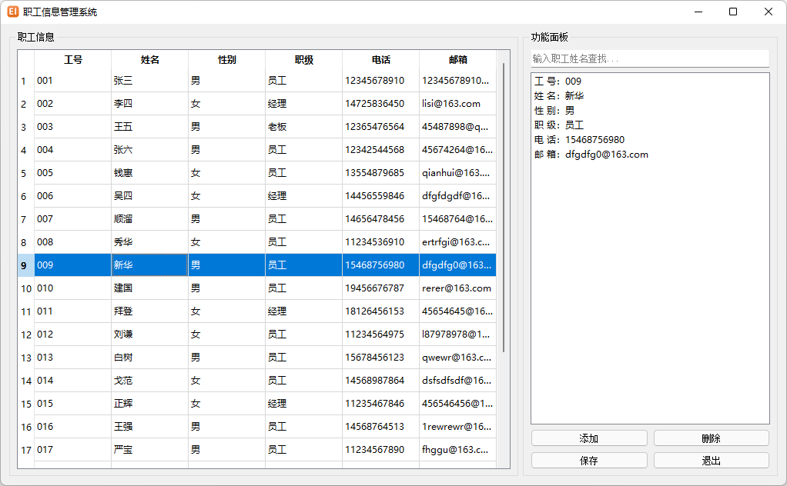

# 基于 Qt 的可视化职工信息管理系统

A Qt-based visual employee information management system

## 需求

可视化职工信息管理系统可以用来直观地管理公司内所有员工的信息。

可存储的职工信息包括：工号、姓名、性别、职级、电话和邮箱。

信息管理系统中需要实现的功能如下：

- 退出管理程序：退出当前管理系统。
- 增加职工信息：可通过按下“添加”按钮后的对话框进行输入，也可以通过直接编写界面上的表格进行输入。
- 显示职工信息：在左侧职工信息面板显示所有职工信息，在右侧功能面板显示选中职工的信息。
- 删除离职职工：选中表格中的职工进行删除。
- 修改职工信息：直接双击表格中的信息进行修改。
- 保存职工信息：将所有职工信息保存在本地文件中。
- 查找职工信息：按照职工姓名进行查找。

## 思路

- 通过创建`MainWidget`实现主界面的所有功能，通过`QGroupBox`实现左右两大面板的划分。
- 通过创建`EditEmpInfoBox`实现添加职工信息的对话框界面。
- 创建职工类`Employee`方便信息的读取与写入。
- 通过`QTableWidget`管理内存中的职工信息，并用`QListWidget`来进行信息的列表展示。
- 通过`QFile`实现文件读写完成数据的持久化。

## 参考

完成过程中参考教程[C语言中文网-Qt教程](http://c.biancheng.net/qt/)

本人在教程基础上进行了一定改进，优化了部分判断逻辑，如将二进制存取文件（QDataStream）改为文本存取文件（QTextStream），实现了本地文件可以人为进行读写和信息的批量处理。

## 下载

- [EmpInfo-1.0](https://pan.baidu.com/s/19Kz5B6ENvii6V5_sfJR8Ig?pwd=0000)